# Academic Universe (AU) — All 16 Modules Mermaid Flowcharts
Standard ISO/ANSI Flowchart Structure: `([Start])`, `[Process]`, `{Decision?}`, `([End])`.
Copy-paste directly into draw.io (`+` -> `Advanced` -> `Mermaid`).

---

## 1. Profile Module
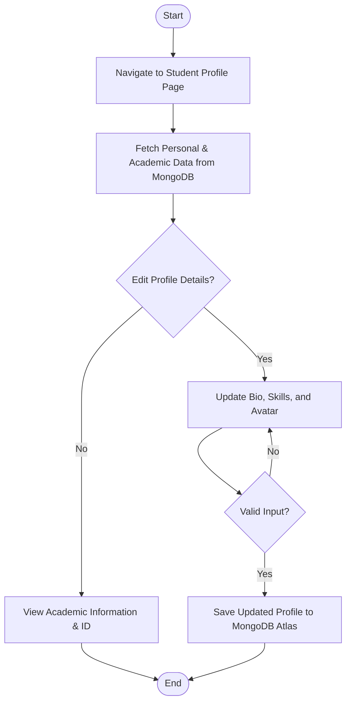

---

## 2. Events from Gmail Module
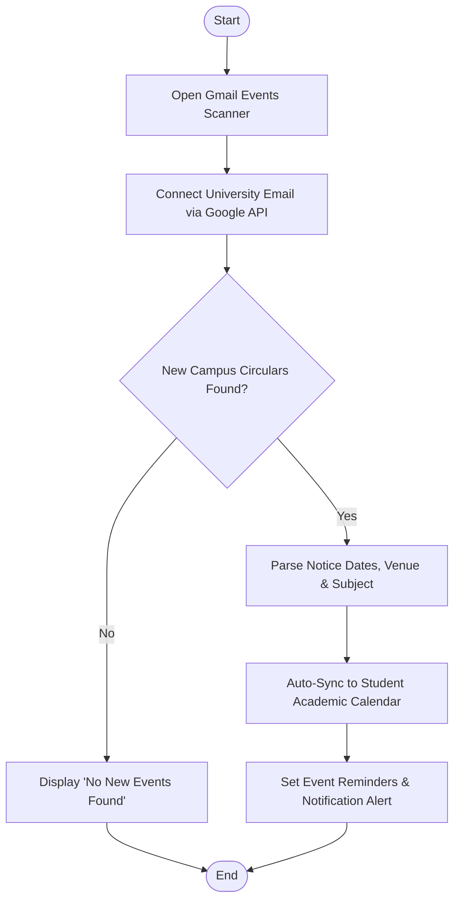

---

## 3. Mail Explorer Module
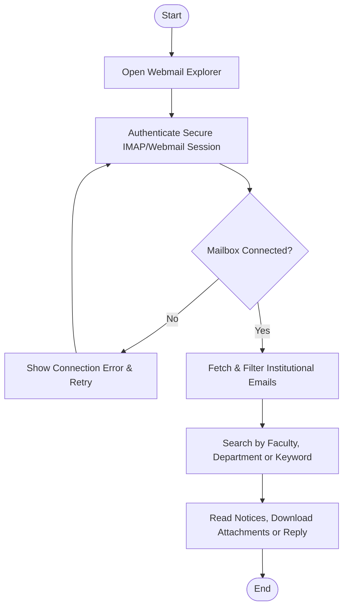

---

## 4. Academic Universe (Timetable & Schedule) Module
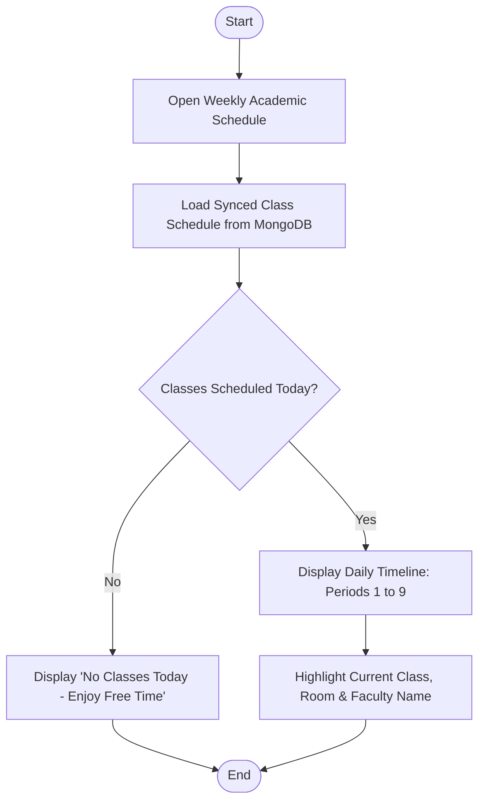

---

## 5. Sync College Profile (E-Zone Sync Engine)
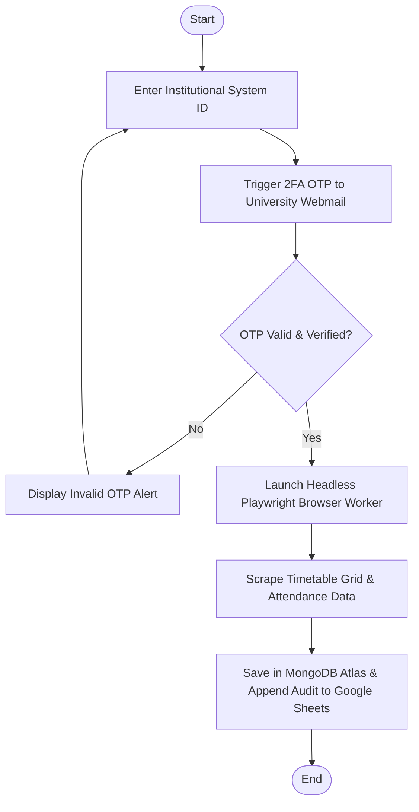

---

## 6. Skill Tracker Module
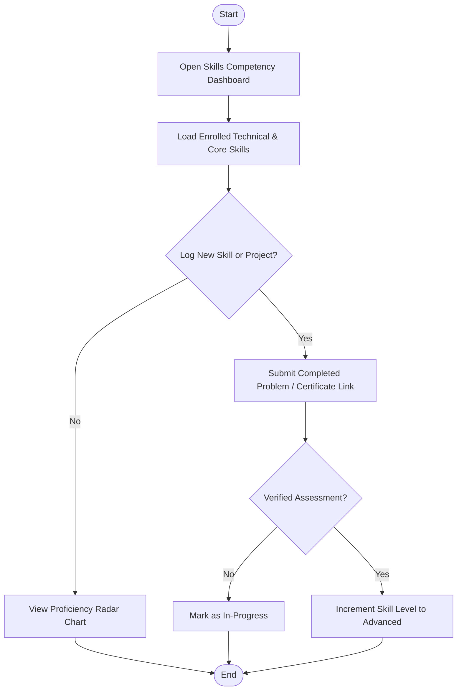

---

## 7. Resume Builder Module
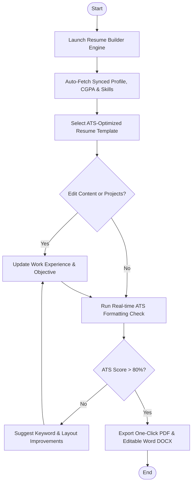

---

## 8. Overlap Engine Module
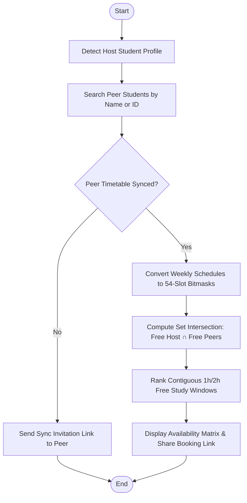

---

## 9. Growth Hub Module
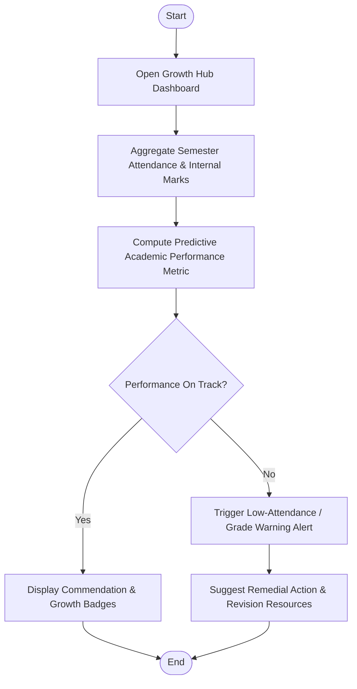

---

## 10. Certificates (Doc Vault Intelligence) Module
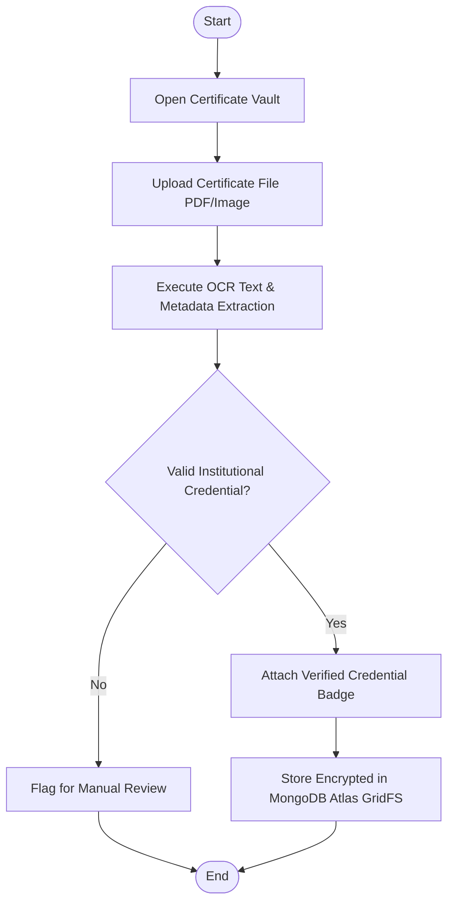

---

## 11. Centralized Presence (Attendance Monitoring) Module
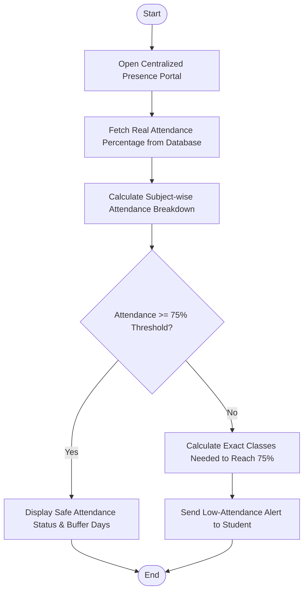

---

## 12. AI Chatbot (Campus AI Advisor) Module
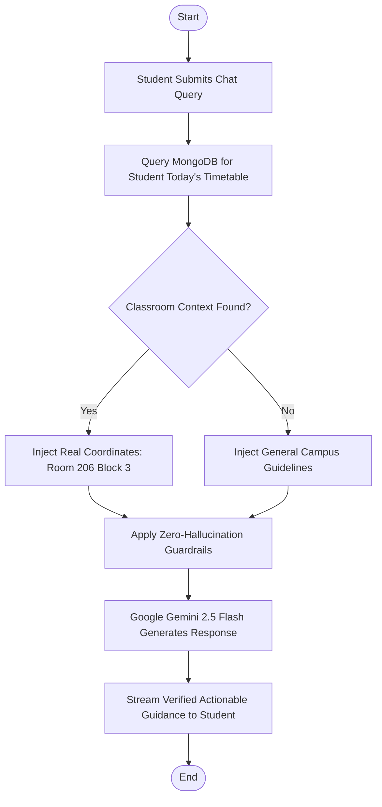

---

## 13. Research Wing Module
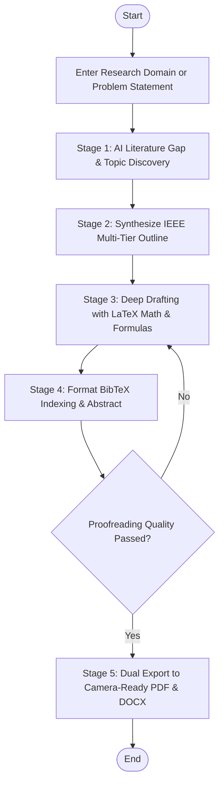

---

## 14. Code Arena Module
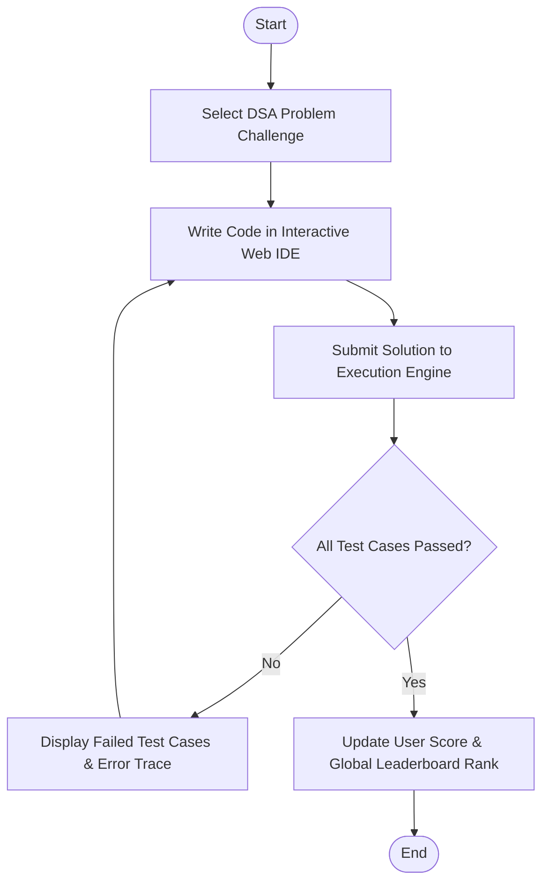

---

## 15. Soft Skills Lab Module
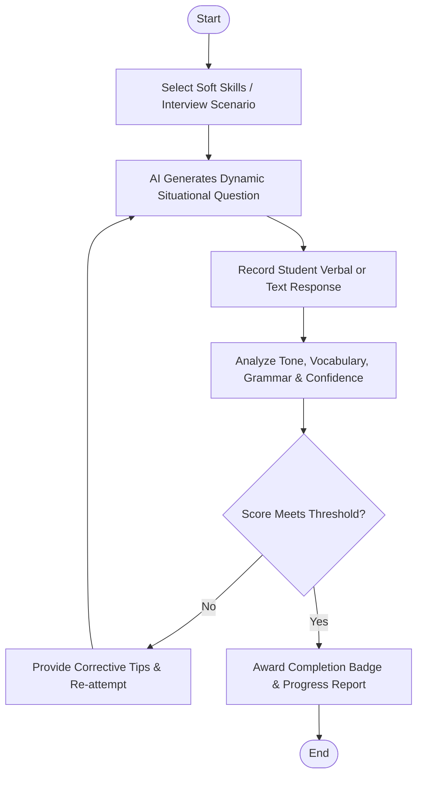

---

## 16. Sign In / Sign Up Module
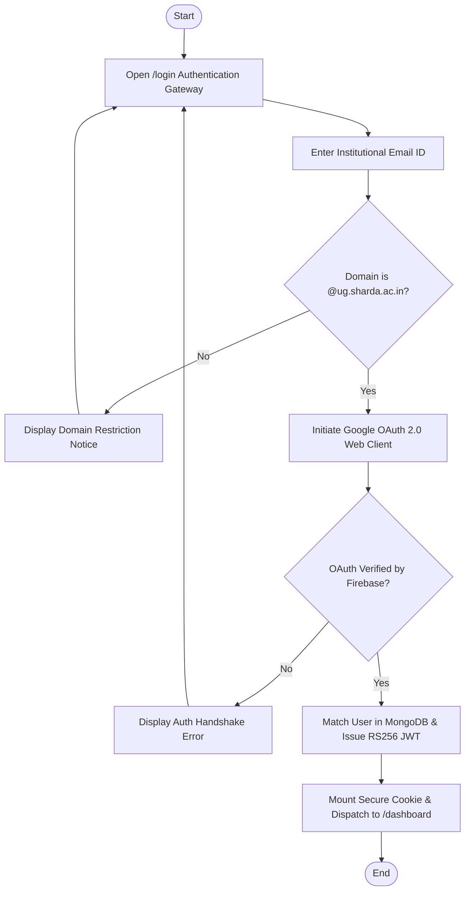
